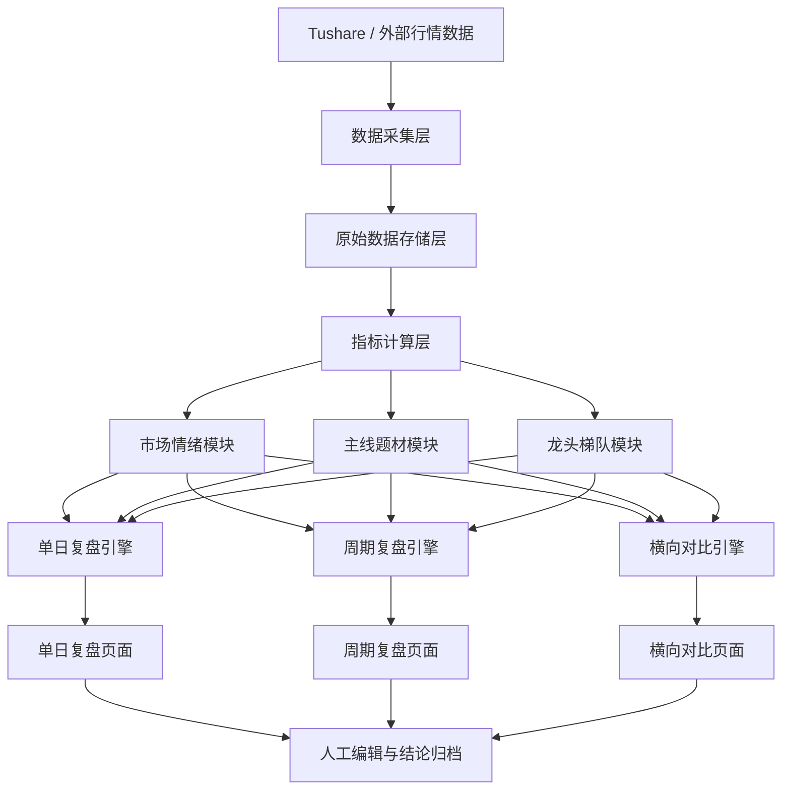
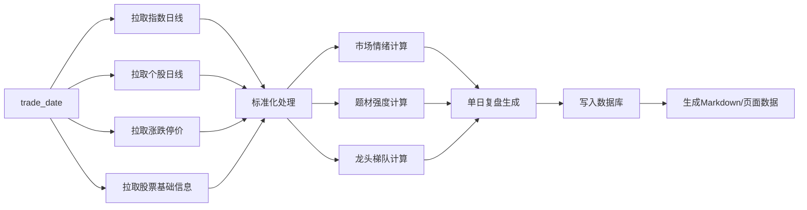
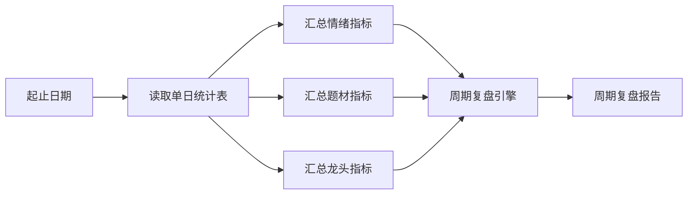

# 龙头复盘系统详细设计说明 v1.0

## 1. 文档目标

本文档定义一套面向 A 股龙头战法的复盘系统详细设计方案。

目标不是做一个“自动写复盘文章”的脚本，而是建设一个可持续使用的交易研究系统，支持：

1. 单日复盘
2. 多日周期复盘
3. 多日横向对比
4. 主线题材追踪
5. 龙头梯队追踪
6. 风险锚追踪
7. 明日预案生成
8. 历史复盘沉淀

这份文档重点回答 8 个问题：

1. 系统要解决什么问题
2. 系统由哪些模块构成
3. 数据如何流动
4. 需要哪些数据库表
5. 页面应该长什么样
6. 每个核心指标怎么计算
7. 系统第一版做到什么程度
8. 后续如何迭代

---

## 2. 系统定位

### 2.1 系统定义

龙头复盘系统是一套“盘后数据分析 + 主观复盘编辑 + 历史对比研究”的交易辅助系统。

其本质是：

> 用标准化结构替代零散复盘，用历史对比替代单日感受，用数据框架辅助龙头交易判断。

### 2.2 主要价值

系统要解决的，不只是“今天怎么看”，而是以下 4 类问题：

1. 今天市场是否适合做龙头接力
2. 今天的主线题材是谁
3. 主线里谁是真龙头、谁是中军、谁是跟风
4. 最近一段时间市场风格有没有变化

### 2.3 典型使用场景

#### 场景 A：日常盘后复盘

收盘后 30 分钟内，系统自动生成：

1. 市场情绪面板
2. 主线题材排名
3. 龙头梯队
4. 风险锚
5. 今日复盘初稿

用户只需要补充：

1. 今日主线判断
2. 今日真龙头
3. 今日最佳买点
4. 今日风险点
5. 明日预案

#### 场景 B：周末阶段复盘

系统自动回看最近：

1. 5 个交易日
2. 10 个交易日
3. 20 个交易日
4. 月度区间

输出：

1. 情绪变化曲线
2. 主线切换路径
3. 龙头切换次数
4. 赚钱效应最强方向
5. 最大风险方向

#### 场景 C：历史横向比较

用户可以比较：

1. 最近 5 天 vs 前 5 天
2. 本周 vs 上周
3. 某轮行情主升期 vs 当前阶段

输出：

1. 当前市场是否转强
2. 当前市场是否退潮
3. 当前接力环境比前一阶段更好还是更差

---

## 3. 设计原则

### 3.1 先数据标准化，再谈结论

系统必须先把数据结构定好，再做分析层。

### 3.2 先自动生成，再人工确认

主线题材和真龙头判断，不应完全自动化。

系统应该提供：

1. 候选排序
2. 对比面板
3. 草稿结论

最终结论由用户确认。

### 3.3 先可用，再复杂

第一版优先完成：

1. 单日复盘
2. 周期复盘
3. 横向对比

暂不追求：

1. Tick 级盘口
2. 新闻语义识别
3. 全自动题材识别

### 3.4 复盘必须支持历史沉淀

没有历史库的复盘系统，只是一次性输出工具，不是研究系统。

---

## 4. 总体架构

系统建议拆成 4 层：

1. 数据采集层
2. 数据处理与指标层
3. 业务分析层
4. 展示与编辑层

### 4.1 架构图



### 4.2 技术栈建议

第一阶段建议：

1. Python
2. Tushare
3. SQLite 或 DuckDB
4. Markdown / JSON 输出

第二阶段建议：

1. FastAPI
2. SQLite / PostgreSQL
3. Jinja2 + HTMX 或 React
4. ECharts

---

## 5. 系统模块设计

## 5.1 数据采集模块

### 职责

1. 拉取交易日历
2. 拉取指数日线
3. 拉取全市场个股日线
4. 拉取涨跌停价格
5. 拉取股票基本信息
6. 拉取行业/概念信息
7. 拉取可选扩展数据

### 输入

1. `trade_date`
2. `token`
3. `数据源配置`

### 输出

1. 原始日线数据
2. 原始涨跌停数据
3. 原始指数数据
4. 原始股票基础信息

### 需要的数据源

MVP 必须有：

1. `trade_cal`
2. `index_daily`
3. `daily`
4. `stk_limit`
5. `stock_basic`

后续可扩展：

1. `concept`
2. `concept_detail`
3. `limit_list_d`
4. `top_list`
5. `moneyflow`

---

## 5.2 数据标准化模块

### 职责

1. 合并日线与涨跌停价格
2. 标记 `ST`
3. 标记涨停/跌停
4. 标记非ST涨停/跌停
5. 生成标准股票快照

### 核心输出字段

1. `is_st`
2. `is_limit_up`
3. `is_limit_down`
4. `is_limit_up_non_st`
5. `is_limit_down_non_st`
6. `industry`
7. `market`
8. `amount_yi`

### 规则

1. 所有短线复盘口径默认剔除 `ST`
2. 所有高度板统计默认剔除 `ST`
3. 所有涨停跌停统计默认剔除 `ST`

---

## 5.3 市场情绪模块

### 职责

1. 生成当日市场情绪画像
2. 输出情绪分和市场阶段

### 核心指标

1. 上涨家数
2. 下跌家数
3. 平盘家数
4. 涨停家数（非ST）
5. 跌停家数（非ST）
6. 5%以上上涨家数
7. 5%以上下跌家数
8. 昨日涨停平均溢价
9. 昨日涨停晋级率
10. 非ST最高连板
11. 非ST连板梯队
12. 两市成交额
13. 较前一日成交额变化

### 输出指标

1. `emotion_score`
2. `market_stage`
3. `risk_level`
4. `is_trade_friendly`

### 市场阶段定义

建议使用：

1. `主升偏强`
2. `修复转强`
3. `轮动市`
4. `分化偏弱`
5. `退潮`

### 情绪分计算建议

建议口径：

1. 涨停数加分
2. 跌停数减分
3. 最高连板加分
4. 晋级率加分
5. 昨日涨停溢价加分
6. 缩量与放量微调

---

## 5.4 主线题材模块

### 职责

1. 统计题材强度
2. 识别主线和次主线
3. 识别周期内的主线切换

### 输入

1. 全市场股票快照
2. 行业/概念映射
3. 连板数据

### 核心指标

1. 题材涨停家数
2. 题材连板家数
3. 题材前排强度
4. 题材成交额
5. 题材连续活跃天数
6. 题材核心股数量

### 输出

1. `theme_score`
2. `theme_rank`
3. `main_theme`
4. `secondary_theme`
5. `weak_theme`

### 题材识别说明

第一版优先支持：

1. 行业题材
2. 手工维护主题映射

第二版再支持：

1. Tushare 概念板块
2. 自定义主题池

---

## 5.5 龙头梯队模块

### 职责

1. 识别非ST最高连板
2. 识别题材龙头
3. 识别容量核心
4. 识别风险锚

### 核心指标

1. 连板数
2. 成交额
3. 题材归属
4. 近期强势天数
5. 次日溢价
6. 在题材中的领先性

### 输出角色

1. `market_leader`
2. `theme_leader`
3. `capacity_core`
4. `assist_stock`
5. `risk_anchor`

### 角色判断规则

#### 市场龙头

优先级：

1. 非ST最高连板
2. 题材地位
3. 辨识度

#### 题材龙头

优先级：

1. 题材内连板最高
2. 题材内最先涨停
3. 成交额与带动性

#### 容量核心

优先级：

1. 成交额大
2. 机构资金易参与
3. 对板块情绪有锚定作用

#### 风险锚

定义：

1. 大成交额跌停
2. 高位大面股
3. 对市场接力情绪伤害最大的票

---

## 5.6 单日复盘模块

### 职责

1. 汇总所有自动数据
2. 输出标准化复盘结构
3. 提供人工修订入口

### 输出内容结构

1. 市场总览
2. 情绪周期判断
3. 主线题材复盘
4. 龙头梯队梳理
5. 核心个股复盘
6. 买点/卖点总结
7. 明日预案

### 数据来源

1. 情绪模块
2. 题材模块
3. 龙头梯队模块
4. 人工编辑补充

---

## 5.7 周期复盘模块

### 职责

1. 汇总一个区间内的单日复盘
2. 输出阶段性总结

### 支持周期

1. 最近 5 日
2. 最近 10 日
3. 最近 20 日
4. 月度
5. 自定义区间

### 周期内重点统计

1. 情绪分均值、最高值、最低值
2. 非ST涨停均值
3. 非ST跌停均值
4. 昨日涨停溢价均值
5. 昨日涨停晋级率均值
6. 非ST最高连板均值和峰值
7. 主线出现次数
8. 龙头切换次数
9. 风险锚出现次数

### 输出内容

1. 周期市场阶段
2. 周期主线排行榜
3. 周期龙头排行榜
4. 周期风险锚排行榜
5. 周期最佳交易模式
6. 周期最危险错误模式

---

## 5.8 横向对比模块

### 职责

1. 对比多个交易日之间的差异
2. 识别市场拐点
3. 判断是否发生风格切换

### 支持的对比方式

1. 最近 5 日逐日对比
2. 最近 10 日逐日对比
3. 两个区间对比
4. 某个主线题材在多个交易日中的对比

### 核心对比项

1. 情绪分
2. 成交额
3. 涨停/跌停
4. 昨日涨停溢价
5. 晋级率
6. 主线题材
7. 龙头高度
8. 风险锚

### 拐点识别规则

建议定义为满足任一条件：

1. 情绪分变化超过 `15`
2. 涨停家数变化超过 `20`
3. 涨停溢价由负转正或由正转负
4. 主线发生切换
5. 非ST最高连板发生断层

---

## 5.9 预案模块

### 职责

1. 根据单日复盘和周期复盘输出次日预案
2. 帮助用户形成盘前观察清单

### 预案字段

1. 明日市场预期
2. 明日主线观察
3. 明日高标观察
4. 明日容量核心观察
5. 明日风险锚观察
6. 明日可做买点
7. 明日禁做情形
8. 仓位建议

---

## 6. 数据流设计

## 6.1 日终数据流



## 6.2 周期数据流



## 6.3 横向对比数据流


---

## 7. 数据库设计

建议第一版使用 `SQLite`。

## 7.1 trade_dates

字段：

1. `trade_date`
2. `prev_trade_date`
3. `is_open`

主键：

1. `trade_date`

## 7.2 raw_index_daily

字段：

1. `trade_date`
2. `ts_code`
3. `close`
4. `open`
5. `high`
6. `low`
7. `pct_chg`
8. `amount`

## 7.3 raw_stock_daily

字段：

1. `trade_date`
2. `ts_code`
3. `close`
4. `open`
5. `high`
6. `low`
7. `pct_chg`
8. `amount`
9. `vol`

## 7.4 stock_basic_info

字段：

1. `ts_code`
2. `name`
3. `industry`
4. `market`
5. `list_status`

## 7.5 daily_stock_snapshot

字段：

1. `trade_date`
2. `ts_code`
3. `name`
4. `industry`
5. `market`
6. `close`
7. `pct_chg`
8. `amount`
9. `is_st`
10. `is_limit_up`
11. `is_limit_down`
12. `board_count`
13. `theme_name`
14. `leader_score`
15. `role_type`

## 7.6 daily_market_stats

字段：

1. `trade_date`
2. `sh_pct`
3. `sz_pct`
4. `cyb_pct`
5. `hs300_pct`
6. `amount_total`
7. `amount_delta`
8. `up_count`
9. `down_count`
10. `flat_count`
11. `limit_up_non_st`
12. `limit_down_non_st`
13. `up_5_count`
14. `down_5_count`
15. `premium_avg`
16. `premium_median`
17. `advance_rate`
18. `highest_board_non_st`
19. `board_dist_json`
20. `emotion_score`
21. `market_stage`

## 7.7 daily_theme_stats

字段：

1. `trade_date`
2. `theme_name`
3. `limit_up_count`
4. `limit_down_count`
5. `board_count`
6. `theme_amount`
7. `core_stock`
8. `capacity_stock`
9. `theme_score`
10. `theme_rank`

## 7.8 daily_leader_stats

字段：

1. `trade_date`
2. `ts_code`
3. `name`
4. `theme_name`
5. `board_count`
6. `amount`
7. `is_market_leader`
8. `is_theme_leader`
9. `is_capacity_core`
10. `is_risk_anchor`
11. `leader_score`

## 7.9 daily_review

字段：

1. `trade_date`
2. `market_stage`
3. `main_theme`
4. `secondary_theme`
5. `market_leader`
6. `capacity_core`
7. `risk_anchor`
8. `best_setup`
9. `bad_setup`
10. `tomorrow_plan`
11. `position_plan`
12. `review_markdown`
13. `review_status`

## 7.10 period_review

字段：

1. `period_id`
2. `start_date`
3. `end_date`
4. `period_type`
5. `emotion_avg`
6. `emotion_max`
7. `emotion_min`
8. `amount_avg`
9. `limit_up_avg`
10. `limit_down_avg`
11. `advance_rate_avg`
12. `premium_avg`
13. `highest_board_max`
14. `main_theme_summary`
15. `leader_summary`
16. `risk_summary`
17. `period_markdown`

## 7.11 compare_result

字段：

1. `compare_id`
2. `compare_type`
3. `left_range`
4. `right_range`
5. `emotion_delta`
6. `amount_delta`
7. `limit_up_delta`
8. `limit_down_delta`
9. `premium_delta`
10. `advance_rate_delta`
11. `main_theme_changed`
12. `leader_changed`
13. `compare_markdown`

---

## 8. 页面设计

建议先规划 7 个页面。

## 8.1 首页仪表盘

用途：

30 秒判断今天市场是否适合做龙头。

区块：

1. 指数区
2. 情绪区
3. 涨停/跌停/晋级区
4. 主线候选区
5. 龙头梯队区

## 8.2 单日复盘页

用途：

查看当天完整复盘。

区块：

1. 自动数据区
2. 主线题材区
3. 龙头梯队区
4. 核心股区
5. 明日预案区
6. 人工编辑区

## 8.3 主线题材页

用途：

查看题材之间的强弱对比。

区块：

1. 题材排行榜
2. 题材详情
3. 题材持续天数
4. 题材内部龙头/中军/跟风

## 8.4 龙头梯队页

用途：

查看非ST高标和容量核心。

区块：

1. 高度板
2. 2板/3板/4板梯队
3. 容量核心
4. 风险锚

## 8.5 周期复盘页

用途：

查看某个周期内的市场演化。

区块：

1. 情绪曲线
2. 成交额曲线
3. 主线演化图
4. 龙头切换图
5. 周期总结

## 8.6 横向对比页

用途：

比较多个交易日或多个区间。

区块：

1. 逐日对比表
2. 区间对比表
3. 拐点提示
4. 风格切换提示

## 8.7 历史档案页

用途：

检索和复用过去的复盘。

筛选条件：

1. 日期
2. 市场阶段
3. 主线题材
4. 龙头个股
5. 情绪区间

---

## 9. 接口设计

如果第二阶段做成 Web，建议按如下 API 设计。

## 9.1 数据刷新接口

### `POST /api/sync/day`

功能：

拉取某日数据并生成单日统计。

请求：

```json
{
  "trade_date": "20260316"
}
```

返回：

```json
{
  "success": true,
  "trade_date": "20260316"
}
```

## 9.2 单日复盘接口

### `GET /api/review/day/{trade_date}`

功能：

获取某日复盘结果。

## 9.3 周期复盘接口

### `GET /api/review/period`

参数：

1. `start_date`
2. `end_date`
3. `period_type`

## 9.4 横向对比接口

### `GET /api/review/compare`

参数：

1. `left_start`
2. `left_end`
3. `right_start`
4. `right_end`

## 9.5 人工编辑保存接口

### `POST /api/review/day/save`

保存人工编辑后的复盘结论。

---

## 10. 指标口径定义

## 10.1 涨停家数

默认定义：

1. 当日收盘价等于涨停价
2. 剔除 `ST`

## 10.2 跌停家数

默认定义：

1. 当日收盘价等于跌停价
2. 剔除 `ST`

## 10.3 最高连板

默认定义：

1. 向前回看连续涨停天数
2. 剔除 `ST`

## 10.4 昨日涨停平均溢价

定义：

1. 昨日非ST涨停股集合
2. 计算这些股票今日收盘相对于昨日收盘的平均涨跌幅

## 10.5 昨日涨停晋级率

定义：

1. 昨日非ST涨停股集合
2. 今日再次非ST涨停的占比

## 10.6 风险锚

定义：

优先选择：

1. 成交额大且跌停
2. 高位大面
3. 对接力情绪伤害最大的票

---

## 11. 核心算法设计

## 11.1 情绪分算法

建议公式可配置：

```text
情绪分 =
基准分
+ 涨停加分
- 跌停减分
+ 最高板加分
+ 晋级率加分
+ 昨日涨停溢价加分
+ 放量修正
```

建议区间：

1. `0-30`：退潮
2. `31-50`：分化偏弱
3. `51-70`：轮动市
4. `71-85`：修复转强
5. `86-100`：主升偏强

## 11.2 主线评分算法

建议结构：

1. 涨停家数 `30%`
2. 连板数量 `20%`
3. 题材成交额 `15%`
4. 容量核心辨识度 `15%`
5. 主线持续天数 `20%`

## 11.3 龙头评分算法

建议结构：

1. 连板高度
2. 题材排名
3. 成交额
4. 历史辨识度
5. 次日溢价
6. 题材带动性

---

## 12. 目录结构建议

建议项目目录：

```text
dragon-review-system/
├── app/
│   ├── collectors/
│   ├── processors/
│   ├── analyzers/
│   ├── services/
│   ├── repositories/
│   ├── api/
│   └── ui/
├── data/
│   ├── raw/
│   ├── db/
│   └── exports/
├── reviews/
│   ├── daily/
│   ├── period/
│   └── compare/
├── scripts/
├── tests/
└── docs/
```

---

## 13. MVP 范围

第一版必须做到：

1. 自动同步单日数据
2. 自动生成非ST口径市场统计
3. 自动生成非ST连板梯队
4. 自动生成主线题材榜
5. 自动生成单日复盘
6. 自动生成最近 5 日 / 10 日 / 20 日周期复盘
7. 自动生成多日横向对比表
8. 支持保存人工结论

第一版可以先不做：

1. Tick 级盘口
2. 新闻语义题材识别
3. 实盘交易联动
4. 复杂权限体系

---

## 14. 迭代路线

### v1.0 数据底座版

目标：

1. 搭建数据库
2. 跑通数据采集
3. 生成单日复盘
4. 生成周期复盘
5. 生成横向对比

### v1.1 工作台版

目标：

1. 新增本地 Web 页
2. 支持复盘编辑
3. 支持历史检索

### v1.2 预案版

目标：

1. 增加盘前预案
2. 增加竞价观察清单
3. 增加阶段风格切换提醒

### v2.0 研究增强版

目标：

1. 接入概念板块
2. 接入龙虎榜/资金流
3. 接入更细的题材和龙头研究能力

---

## 15. 最终结论

这个系统最终不是“帮你写一篇复盘”，而是帮你建立一套复盘研究基础设施。

它的最终价值体现在 3 点：

1. 每天复盘有固定结构，不会遗漏关键维度
2. 周期复盘能帮你看清市场是在转强还是转弱
3. 横向对比能帮你识别行情拐点、主线切换和策略适配点

一句话总结：

> 龙头复盘系统的核心，不是生成内容，而是沉淀认知、识别变化、服务交易决策。

